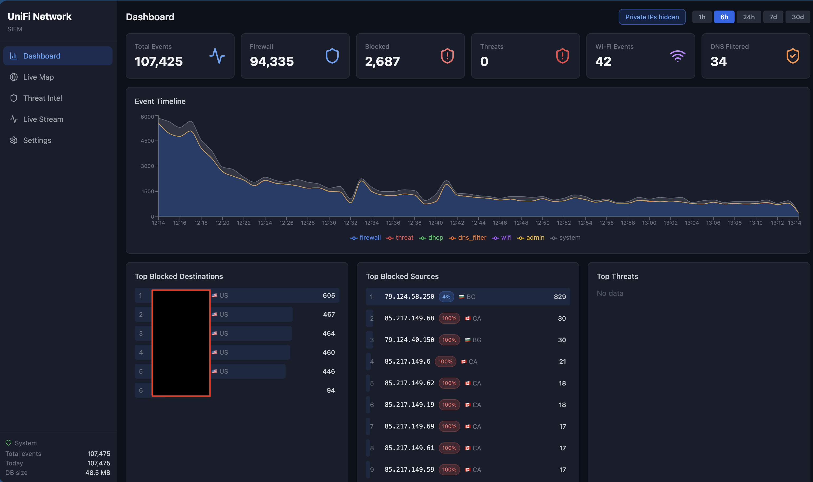
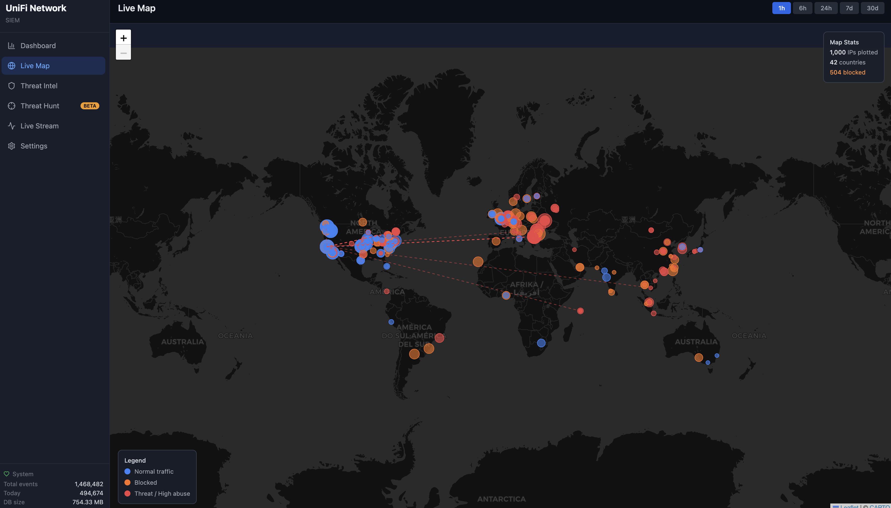
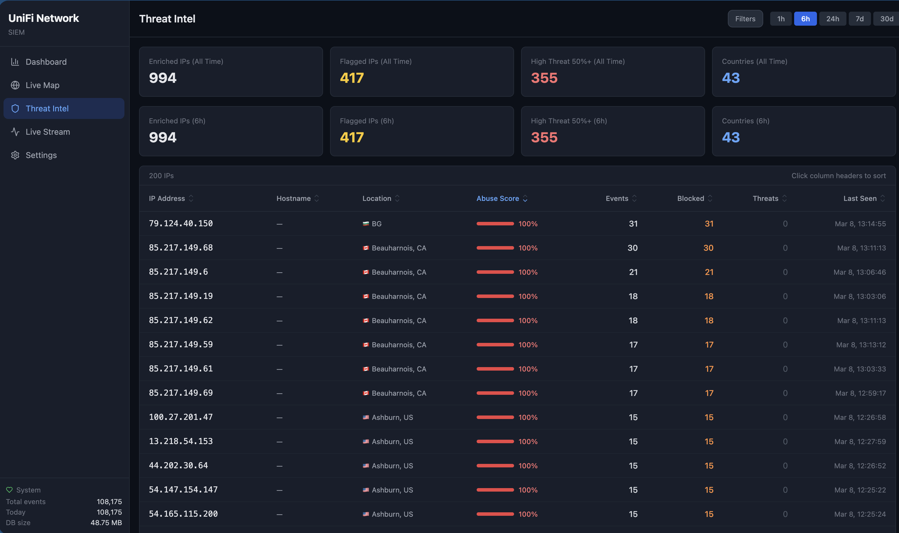
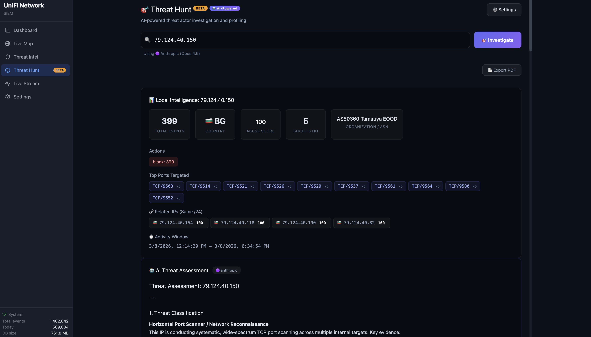
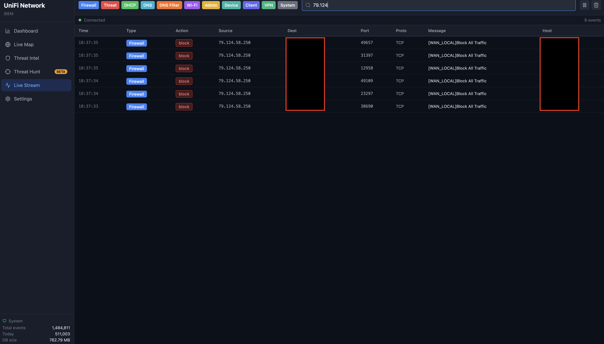
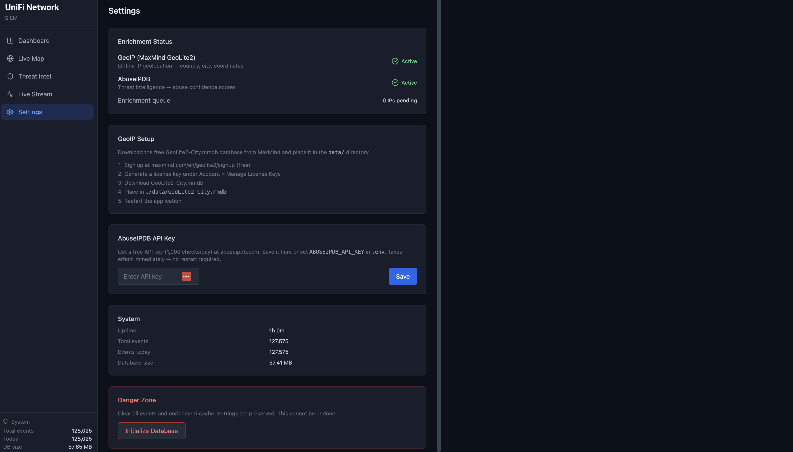

# UniFi Network SIEM


A self-contained, **AI-powered** Node.js application that collects syslog from UniFi consoles and gateways, parses all event types, stores them in SQLite, and serves a real-time security dashboard with built-in AI threat hunting.

## Features

- **Syslog collector** — UDP listener for UniFi Traffic Logging and Activity Logging (CEF)
- **11 event type parsers** — firewall, threat, DHCP, DNS, DNS filter (CoreDNS ad-block), Wi-Fi, admin, device, client, VPN, system
- **Real-time live stream** — WebSocket-powered event table with type/action badges, search, and pause
- **Dashboard** — stats cards, event timeline chart, top blocked, top threats, top ports, top clients, top sources, top destinations
- **Live Map** — Leaflet-based world map showing geo-enriched traffic with color-coded markers (normal/blocked/threat), flow lines, and stats overlay
- **GeoIP & threat enrichment** — MaxMind GeoLite2 for geolocation, AbuseIPDB for threat scoring, reverse DNS — all async with caching
- **Country flags & abuse badges** — 🇺🇸 emoji flags with country codes on external IPs; color-coded abuse score badges across all views
- **Threat Intel** — sortable/filterable table of enriched IPs with abuse scores, event counts, and locations; period-filtered summary cards alongside all-time totals
- **Threat Hunt (Beta)** — AI-powered threat actor investigation. Enter any IP to get a full profile: local SIEM activity (events, ports, timeline, IDS signatures, related /24 IPs), external intel (rDNS, WHOIS/ASN), and a structured AI threat assessment with PDF export. Supports Anthropic (Opus 4.6), OpenAI (GPT-5.4), and Google (Gemini 3.1 Pro) with on-page API key management. *Currently tested with Anthropic only — OpenAI and Google integrations are implemented but untested.*
- **HTTPS by default** — auto-generated self-signed TLS certificate
- **Pluggable storage backends** — SQLite (built-in default), WardSONDB (Beta), OpenSearch (Beta — Coming Soon)
- **SQLite storage** — WAL mode, batched inserts, automatic retention cleanup, worker thread enrichment
- **Zero external services** — everything runs in one process

## Screenshots

### Dashboard


### Live Map


### Threat Intel


### Threat Hunt (Beta)


### Live Stream


### Settings


## Quick Start

### Prerequisites

- Node.js v18+
- macOS, Linux, or Windows (any platform with Node.js and `better-sqlite3` support)

### Install

```bash
# Backend
npm install

# Frontend
cd frontend && npm install && cd ..

# Configure
cp .env.example .env
# Edit .env if needed (defaults work for most setups)
```

### Run

```bash
# Production (serves built frontend)
cd frontend && npm run build && cd ..
npm start

# Development (two terminals)
npm run dev          # Backend with auto-reload (port 3000)
cd frontend && npm run dev   # Vite HMR (port 5173)
```

Open https://localhost:3000 in your browser. Accept the self-signed certificate warning on first visit.

### Test with fake syslog

```bash
node scripts/test-syslog.js
# Sends 10 msgs/sec by default. Set RATE=100 for more volume.
```

## UniFi Console Configuration

For full functionality, three logging sources on the UniFi Console should be configured. All share the same UDP port — the parser auto-detects the format.

### Source 1: Traffic Logging / Syslog (firewall, IDS, DHCP, Wi-Fi)

1. **Settings > Policy Engine** — for each firewall rule, Edit > Advanced > **Enable Syslog Logging**

> ⚠️ **Important**: This must be enabled on **every firewall rule** you want to monitor — including WAN IN/OUT and inter-VLAN rules. Rules without syslog enabled will pass/drop traffic silently with no log sent. This is the most commonly missed step and will result in missing events (especially external IP traffic needed for the Live Map and Threat Intel).

2. **Settings > CyberSecure > Traffic Logging**:
   - Flow Logging: **All Traffic** (or Blocked Only for less volume)
   - Activity Logging (Syslog): Enable **SIEM Server**
   - Server Address: `<your-machine-ip>`
   - Port: `5514`
   - Categories: Enable all desired (Firewall Default Policy, Security Detections, etc.)

### Source 2: Activity Logging / CEF (admin, device, client events)

1. **Settings > Control Plane > Integrations > Activity Logging**:
   - Enable **SIEM Server**
   - Server Address: `<your-machine-ip>`
   - Port: `5514`
   - Categories: Enable Clients, Devices, Security Detections, Triggers, VPN, Critical

### Source 3: Debug Logs (detailed DHCP, system processes)

1. **Settings > CyberSecure > Traffic Logging**:
   - Enable **Debug Logs**
   - This enables detailed `dnsmasq-dhcp` lease events, `ubios-udapi-server` messages, and other system process logs from the gateway
   - Without this, DHCP events and many system-level messages won't be forwarded

### Source 4: Netconsole (kernel-level logging)

1. **Settings > CyberSecure > Traffic Logging**:
   - Enable **Netconsole**
   - Server Address: `<your-machine-ip>`
   - Port: `5514`
   - Provides kernel-level messages including firewall rule hits and low-level network events

> **Note**: All four sources can point to the same IP and port. The parser auto-detects CEF, iptables, CoreDNS JSON, hostapd, dnsmasq, and other formats automatically.

## Event Types

| Type | Source | Description |
|---|---|---|
| `firewall` | Traffic Logging | Firewall allow/block decisions (iptables) |
| `threat` | Traffic Logging / CEF | IDS/IPS alerts (Suricata) and CEF threat detections |
| `dhcp` | Traffic Logging | DHCP lease events (dnsmasq + switch relay) |
| `dns` | Traffic Logging | DNS queries/replies (if logging enabled) |
| `dns_filter` | Traffic Logging | CoreDNS ad-block and content filtering blocks |
| `wifi` | Traffic Logging | Wi-Fi client associate/disassociate (hostapd) |
| `admin` | CEF | Admin login, config changes |
| `device` | CEF | Device adoption, restart, firmware |
| `client` | CEF | Client connect/disconnect, roaming |
| `vpn` | CEF / Traffic Logging | VPN tunnel up/down events |
| `system` | Either | Catch-all for unclassified messages |

## API

| Endpoint | Description |
|---|---|
| `GET /api/events` | Query events with filters (type, action, IP, port, search, pagination) |
| `GET /api/events/:id` | Single event detail |
| `GET /api/stats/overview` | Summary counts by type and action |
| `GET /api/stats/timeline` | Time-bucketed event counts for charts |
| `GET /api/stats/top-talkers` | Top source or destination IPs |
| `GET /api/stats/top-blocked` | Top blocked IPs (src or dst direction, exclude_private) |
| `GET /api/stats/top-ports` | Top destination ports |
| `GET /api/stats/top-clients` | Top clients by MAC across event types |
| `GET /api/stats/top-threats` | Top IDS/IPS signatures |
| `GET /api/stats/threat-intel` | Enriched IPs with abuse scores and event counts |
| `GET /api/stats/geo-events` | Aggregated IPs with geo coordinates for map |
| `GET /api/stats/recent-geo-events` | Recent events with geo data for flow lines |
| `GET /api/health` | System health, event counts, DB size |
| `GET /api/settings` | App settings (sensitive values redacted) |
| `PUT /api/settings` | Update settings (AbuseIPDB key, etc.) |
| `POST /api/settings/reset-db` | Clear all events and enrichment cache |
| `GET /api/threat-hunt/settings` | Threat Hunt AI provider settings |
| `PUT /api/threat-hunt/settings` | Update AI provider/keys |
| `POST /api/threat-hunt/investigate` | Run AI-powered threat investigation on an IP |
| `WSS /ws/events` | Live event stream with filtering |

## Configuration (.env)

| Variable | Default | Description |
|---|---|---|
| `SYSLOG_PORT` | 5514 | UDP port for syslog listener |
| `HTTP_PORT` | 3000 | Web dashboard port |
| `DB_PATH` | ./data/events.db | SQLite database path |
| `RETENTION_DAYS` | 60 | Auto-delete events older than this |
| `LOG_LEVEL` | info | Logging level (trace/debug/info/warn/error) |
| `GEOIP_DB_PATH` | ./data/GeoLite2-City.mmdb | Path to MaxMind GeoLite2 database |
| `ABUSEIPDB_API_KEY` | *(empty)* | AbuseIPDB API key (free tier: 1000/day) |
| `ABUSEIPDB_CACHE_HOURS` | 24 | Cache duration for abuse scores |
| `RDNS_ENABLED` | false | Enable reverse DNS lookups |
| `LOG_RAW_MESSAGES` | false | Store raw syslog text in DB |
| `INSERT_BATCH_SIZE` | 50 | Batch insert threshold |
| `INSERT_BATCH_INTERVAL_MS` | 500 | Batch insert flush interval |

> **⚠️ Important:** Settings and configuration are always stored in the local SQLite database (`data/events.db`), regardless of which storage backend is active. Do not delete this file even when using WardSONDB or OpenSearch — it contains your backend configuration, API keys, and other settings needed to boot the application. Changing the storage backend requires a SIEM restart to take effect.

## Project Structure

```
src/
  index.js                    # Entry point
  config.js                   # Environment config
  collector/
    syslog-server.js           # UDP listener
    parsers/
      index.js                 # Format detection & routing
      syslog-header.js         # Header parser (4 formats)
      firewall.js              # iptables parser
      ids.js                   # Suricata IDS parser
      dhcp.js                  # dnsmasq-dhcp parser
      dhcp-relay.js            # Switch DHCP relay parser
      dns.js                   # dnsmasq DNS parser
      coredns.js               # CoreDNS ad-block/content filter
      wifi.js                  # hostapd parser
      cef.js                   # CEF (Activity Logging) parser
      system.js                # Catch-all parser
  db/
    database.js                # SQLite connection & schema
    events.js                  # Event CRUD & batch insert
    retention.js               # Periodic cleanup
    backends/
      interface.js             # StorageBackend base class
      index.js                 # Backend registry & factory
      sqlite.js                # SQLite backend (default)
      wardsondb.js             # WardSONDB backend (Beta)
      opensearch.js            # OpenSearch backend (Beta — Coming Soon)
  api/
    server.js                  # Express + static serving
    websocket.js               # WebSocket live stream
    routes/                    # REST API routes
  utils/                       # IP utils, port names, constants

  enrichment/
    geoip.js                   # MaxMind GeoLite2 lookup
    abuseipdb.js               # AbuseIPDB API client
    rdns.js                    # Reverse DNS lookup
    enrichment-queue.js        # Async enrichment coordinator
    enrichment-worker.js       # Worker thread for UPDATE operations
  db/cache.js                  # IP enrichment cache

frontend/                      # React + Vite + Tailwind
  src/
    components/
      live/                    # Live stream view
      dashboard/               # Analytics dashboard
      map/                     # Live Map (Leaflet)
      intel/                   # Threat Intel view
      hunt/                    # Threat Hunt (Beta) — AI investigation
      shared/                  # Badges, selectors
    hooks/                     # WebSocket & query hooks
    lib/                       # API client, formatters

scripts/
  test-syslog.js               # Test message generator
```

## Enrichment Setup (Optional)

### GeoIP (enables Live Map)

1. Sign up at [MaxMind](https://www.maxmind.com/en/geolite2/signup) (free)
2. Download `GeoLite2-City.mmdb`
3. Place in `./data/GeoLite2-City.mmdb`

### AbuseIPDB (threat scoring)

1. Get a free API key at [abuseipdb.com](https://www.abuseipdb.com) (1000 lookups/day)
2. Set `ABUSEIPDB_API_KEY` in `.env`, or save via the Settings page (no restart needed)
3. If the daily limit is reached, lookups automatically back off for 1 hour

## Security

The app runs HTTPS by default with an auto-generated self-signed certificate. Below are remaining security considerations.

| Concern | Severity | Description |
|---|---|---|
| No authentication | **Medium** | The web UI, API, and database reset are accessible to anyone who can reach port 3000. On a trusted home network this is acceptable. If exposed beyond your LAN, put it behind a reverse proxy with auth (nginx/Caddy with basic auth or mTLS). |
| Syslog spoofing | **Low** | The UDP syslog listener accepts messages from any source on the network. A device on your LAN could send crafted syslog to inject fake events. UDP has no authentication by design — this is inherent to syslog. |
| Database reset without auth | **Low** | The `POST /api/settings/reset-db` endpoint requires no credentials. Mitigated by the network-only access constraint and the two-click confirmation in the UI. |
| TLS certificate trust | **Info** | The self-signed certificate will trigger browser warnings. For production, replace `data/server.key` and `data/server.cert` with certs from a trusted CA or your own internal CA. |

**Known advisories:**
- **esbuild ≤ 0.24.2 (moderate)** — allows any website to send requests to the Vite dev server and read responses ([GHSA-67mh-4wv8-2f99](https://github.com/advisories/GHSA-67mh-4wv8-2f99)). This is a dev-only dependency used during frontend development — it does not affect production builds or the deployed SIEM. Fix requires upgrading Vite to 7.x (breaking change).

**Already mitigated:**
- **SQL injection** — all queries use parameterized prepared statements
- **XSS** — React auto-escapes all rendered content including untrusted syslog data
- **API key exposure** — AbuseIPDB key is redacted in API responses (last 4 chars only)
- **Transport security** — HTTPS/WSS enabled by default with auto-generated TLS certificate
- **Parser crashes** — all parsers wrapped in try/catch with fallback to system parser
- **AbuseIPDB rate limits** — automatic 1-hour backoff when daily limit is reached

## Known Issues

| Issue | Status | Description |
|---|---|---|
| AbuseIPDB scores not populating | **Fixed** | AbuseIPDB API field name was `abuseConfidenceScore` but code referenced `abuseConfidencePercentage` — scores were always `null`. Fixed in commit `11607e4`. Also added re-queue logic for cached IPs missing abuse scores. |
| Database reset pegs CPU on large datasets | **Fixed** | Using "Initialize Database" previously ran `DELETE` + `VACUUM` on millions of rows, pegging CPU at 100% for 10+ minutes. Fixed by switching to `DROP TABLE` + schema recreate, which is instant regardless of database size. Fixed in commit `11607e4`. |
| Enrichment backfill pegs CPU at 100% | **Fixed** | Backfill UPDATE queries blocked the main Node.js event loop via synchronous `better-sqlite3` calls, sustaining 99% CPU for 4+ hours. Fixed by moving all enrichment UPDATEs to a dedicated `worker_threads` Worker with its own DB connection. Backfill of 6,600+ IPs now completes in ~1.5 minutes with 0% main thread CPU. Fixed in commit `ca0f8ea`. |

## Roadmap

- [x] Abuse score badges on IPs in tables
- [x] Country flags on external IPs
- [ ] Threat Hunting view — AI-powered investigation workspace for profiling threat actors (IP timeline, associated events, geo history, abuse reports, related IPs). Integrates with Gemini, OpenAI, or Anthropic APIs for automated threat analysis and natural language investigation queries
- [ ] CSV export
- [ ] Dark/light mode toggle
- [x] Performance optimization — enrichment backfill moved to worker thread for non-blocking operation
- [x] Storage backend abstraction — pluggable database engine (SQLite, WardSONDB, OpenSearch) selectable from Settings
- [x] WardSONDB integration — high-performance Rust-based JSON document database with deferred index creation and write pressure detection
- [ ] OpenSearch integration — enterprise search and analytics engine with built-in SIEM capabilities
- [ ] Query performance optimization — tuning for large datasets (millions of rows)
- [ ] launchd plist for macOS auto-start
